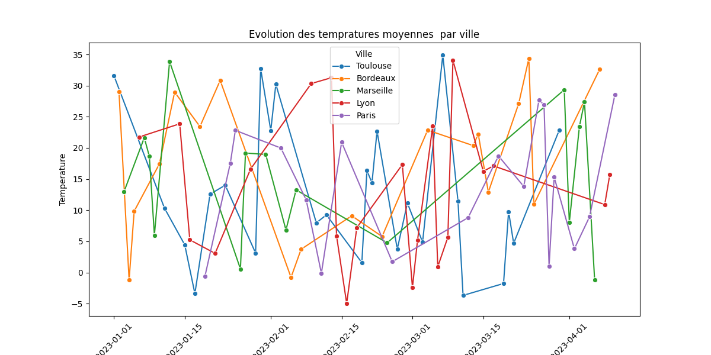
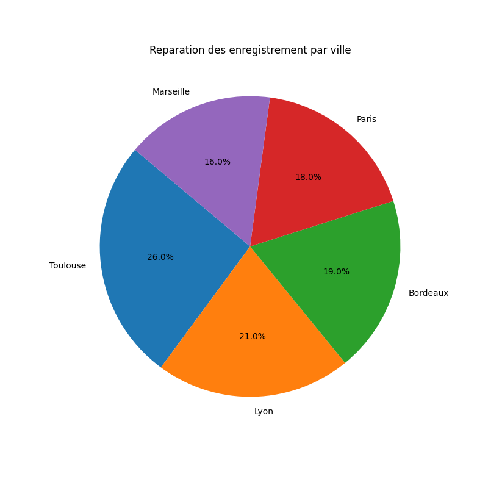
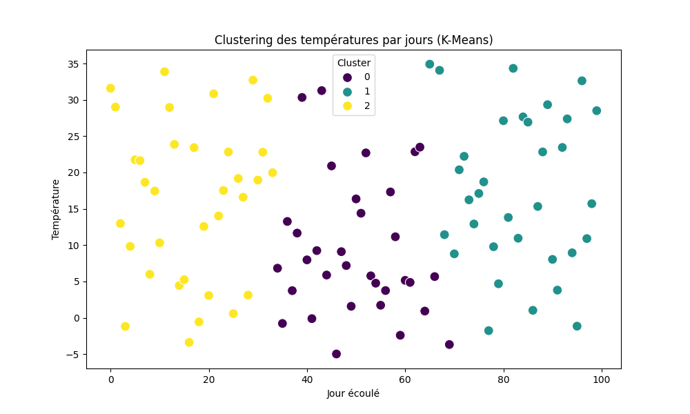

# Exploratory Data Analysis on Simulated City Temperature Data

This project performs exploratory data analysis (EDA) on simulated temperature data for five French cities: Paris, Lyon, Marseille, Toulouse, and Bordeaux. The dataset spans 100 consecutive days starting from January 1, 2023. The analysis includes data visualization, statistical summaries, and clustering using K-Means.

## 📊 Features

- **Data Generation**: Simulates temperature data for multiple cities over a 100-day period.
- **Descriptive Statistics**: Provides statistical summaries of the dataset.
- **Data Filtering**: Allows filtering of data by city and by specific date ranges.
- **Visualizations**:
  - Line plots showing temperature trends over time for each city.
  - Pie chart representing the distribution of data entries per city.
  - Scatter plot illustrating K-Means clustering of temperatures over days.
- **Clustering**: Applies K-Means clustering to identify patterns in temperature data.
- **Prediction**: Estimates temperature for a future day based on clustering results.

## 📁 Project Structure

```
Exploratory-Data-Analysis/
├── assets/
│   ├── lineplot.png
│   ├── piechart.png
│   └── clustering.png
├── eda_temperature_analysis.py
└── README.md
```

## 🖼️ Visualizations

### Temperature Trends by City



### Distribution of Data Entries per City



### K-Means Clustering of Temperatures



## 📦 Dependencies

- Python 3.x
- pandas
- numpy
- matplotlib
- seaborn
- scikit-learn

## 🚀 Getting Started

1. **Clone the repository**:

   ```bash
   git clone https://github.com/youssefkhalifa04/Exploratory-Data-Analysis.git
   cd Exploratory-Data-Analysis
   ```

2. **Install the required packages**:

   ```bash
   pip install pandas numpy matplotlib seaborn scikit-learn
   ```

3. **Run the analysis script**:

   ```bash
   python eda_temperature_analysis.py
   ```

   This will generate the visualizations and display statistical summaries in the console.

## 📈 Results

- **Descriptive Statistics**: Provides mean, standard deviation, min, max, and quartiles for temperature data.
- **City-wise Analysis**: Enables focused analysis on specific cities, such as Paris.
- **Monthly Averages**: Calculates average temperatures per month.
- **Clustering**: Groups temperature data into clusters to identify patterns.
- **Prediction**: Estimates temperature for day 120 based on clustering.

## 📬 Contact

For any questions or suggestions, feel free to contact me khalifayoussef297@gmail.com .

